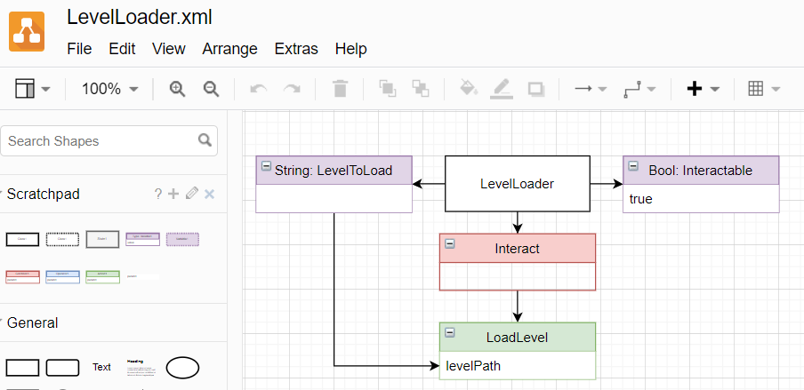
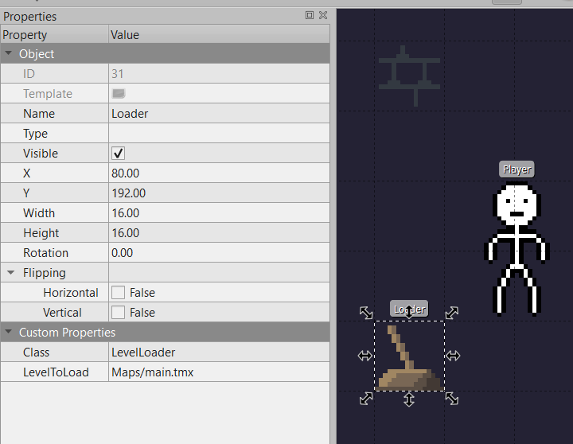

# Runtime

## Named Engine - small engine for small games

Draw some code using [draw.io](https://draw.io):

Use it in your [Tiled](https://www.mapeditor.org/) map:

Try it with NamedEngine!

## Try it!

* You can download the latest version [right from this repo](https://github.com/NamedEngine/runtime/releases)
* Documentation, guides and examples can be found in [docs repo](https://github.com/NamedEngine/docs)
* Use [isssues](https://github.com/NamedEngine/runtime/issues) to report any bug you encounter
or send them to [namedengine@gmail.com](mailto:namedengine@gmail.com)
